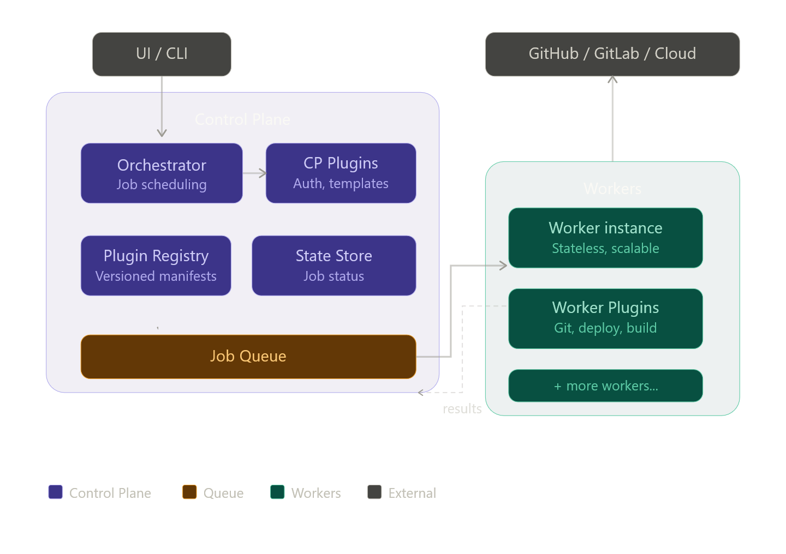

# Architecture — Macro View

## Purpose

This document describes ProvisionHub at system level: boundaries, major components, key decisions, and end-to-end flow. Decision rationale is tracked in ADRs under docs/adr.

---

## System Context

ProvisionHub sits between platform users and external providers.

- Inputs: service provisioning requests, templates, policy constraints
- Outputs: repositories, CI pipelines, infrastructure resources, integration bindings
- External dependencies: source control APIs, cloud providers, artifact systems, identity providers

---

## Container-Level Architecture

Primary containers:

1. UI and/or CLI

- Entry points for platform consumers and operators
- Submits provisioning intents
- UI is a replaceable reference component and not a runtime dependency of Control Plane or Workers

2. Control Plane

- Validates and orchestrates workflows
- Manages plugin lifecycle
- Schedules and tracks jobs
- Exposes REST and gRPC APIs

3. Queue Backbone

- Durable, asynchronous handoff between orchestration and execution
- Enables scaling and fault isolation

4. Workers

- Stateless execution units
- Consume jobs and invoke provider plugins
- Report status and results

5. Plugin Runtime

- Control Plane plugins for orchestration and policy
- Worker plugins for provider actions

---

## Macro Design Decisions

1. Monorepo in Go for core services

- Improves shared package reuse and consistent build tooling
- See ADR: docs/adr/0001-go-monorepo.md

2. gRPC contracts for plugin interoperability

- Enables multi-language plugin implementations with stable contracts
- See ADR: docs/adr/0002-grpc-plugin-contract.md

3. Standard UI in monorepo, fully decoupled

- Provides a default interface without coupling core lifecycle to frontend implementation
- Can be rebuilt or replaced internally using documented API contracts and flows
- See guide: docs/architecture/ui-rebuild.md

---

## End-to-End Flow

1. Request ingestion

- User triggers a provisioning request through API/CLI/UI
- Control Plane authenticates and validates the request

2. Planning and orchestration

- Control Plane plugin resolves template and policy
- Produces an ordered execution plan

3. Job emission

- Plan is decomposed into jobs with provider-specific payloads
- Jobs are persisted to queue topics/partitions

4. Distributed execution

- Worker claims job and loads appropriate Worker plugin
- Plugin performs external action (for example, create repository)

5. Result reporting

- Worker reports state transition and result payload
- Control Plane aggregates outcomes and triggers downstream jobs

6. Completion

- Final workflow status returned to caller and stored for audit

---

## Responsibilities and Boundaries

Control Plane is responsible for:

- Intent validation
- Planning and job scheduling
- Plugin process management (control-plane scope)
- Workflow state and API surface

Control Plane is not responsible for:

- Running heavy provider-side operations
- Long-running execution tasks that belong to workers

Workers are responsible for:

- Executing jobs idempotently
- Provider API/CLI integrations
- Secure secret usage during execution

Workers are not responsible for:

- Global orchestration decisions
- Cross-workflow planning

Reference UI is responsible for:

- Presenting workflows and status to users
- Consuming Control Plane APIs and contracts

Reference UI is not responsible for:

- Owning orchestration logic
- Executing provider operations

---

## Reliability and Scale Considerations

- Queue decoupling protects Control Plane from execution spikes
- Worker horizontal scale handles burst provisioning workloads
- Retry and DLQ policies isolate transient failures
- Idempotent execution rules prevent duplicate side effects

---

## Security Posture (Macro)

- mTLS for service-to-service communication
- Least-privilege credentials for plugin execution
- Signed plugin artifacts and version pinning
- Audit trail for job lifecycle and plugin actions

---

## Traceability

Architecture decisions should map to ADRs and implementation docs:

- Overview: docs/overview.md
- Macro architecture: docs/architecture/architecture.md
- UI rebuild guide: docs/architecture/ui-rebuild.md
- ADR index: docs/adr/
